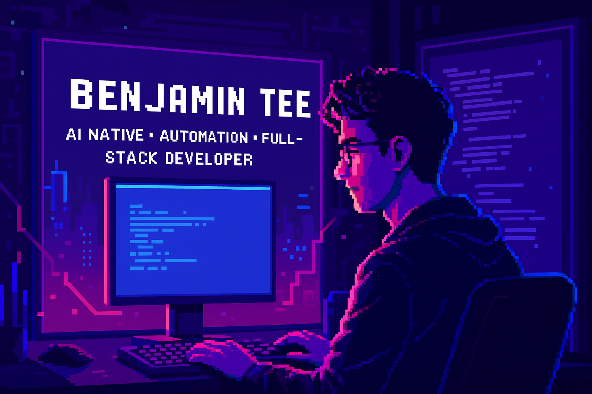

<p align="center">
  
</p>

<h1 align="center">👋 Hey, I'm <strong>Benjamin Tee</strong></h1>
<p align="center">
  🇸🇬 Singapore • AI Native • Automation • Full-Stack Developer  
</p>

---

## 🚀 About Me

I'm Benjamin — an AI-native builder from Singapore who loves creating **automated systems**, **intelligent tools**, and **full-stack experiences** that actually solve real problems.

I blend:
- 🧠 AI engineering  
- ⚙️ Automation & workflow orchestration  
- 💻 Full-stack development  
- 🎨 A clean, stylish, slightly cyberpunk aesthetic  

---
## 🧠 AI & Automation Stack

<p>       </p>

## 💻 Full-Stack Engineering

Frontend
<p>     </p>
Backend
<p>    </p>
Databases
<p>     </p>

## 🧩 Focus Areas

```yaml
name: Benjamin Tee
from: Singapore
roles:
  - AI Native
  - Automation Engineer
  - Full-Stack Developer
interests:
  - Autonomous AI agents
  - Workflow automation
  - Full-stack engineering
  - LLM systems
  - Developer tooling
currently_building:
  - AI-driven automation pipelines
  - Productive dev tools
  - Intelligent dashboards
strengths:
  - Systems thinking
  - UI/UX intuition
  - High efficiency workflows
